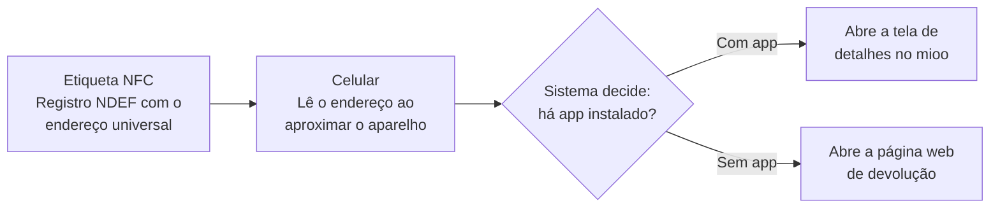
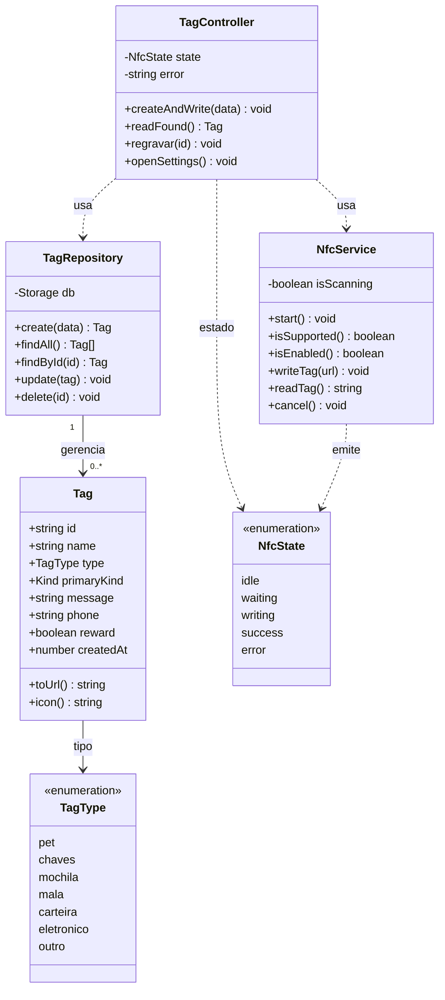

# mioo — Aplicativo de identificação via NFC

> **o app cuida do que é seu.**
> Reconexão de objetos e animais de estimação aos seus donos por meio de etiquetas inteligentes (NFC).

O **mioo** é um aplicativo móvel (Android e iOS) que usa a tecnologia de comunicação por
aproximação (**NFC**) para reconectar objetos e pets aos seus donos. O dono cria uma etiqueta,
cola num objeto (coleira, chaves, mochila, mala, carteira, eletrônico…) e grava nela um recado e
meios de contato. Se o item se perde, quem o encontra apenas **aproxima o celular** da etiqueta e
recebe as informações de devolução num toque — **mesmo sem ter o aplicativo instalado, sem
cadastro e sem conexão com a internet**.

A etiqueta não guarda dados pessoais: ela grava apenas um **endereço universal único**
(`https://mioo.app/t/{id}`). Isso preserva a privacidade do dono, permite atualizar o conteúdo a
qualquer momento e mantém o custo por etiqueta muito baixo.

---

## Sumário

- [O problema](#o-problema)
- [Como funciona](#como-funciona)
- [Requisitos funcionais](#requisitos-funcionais)
- [Requisitos não funcionais](#requisitos-não-funcionais)
- [Tipos de objeto](#tipos-de-objeto)
- [Telas e fluxos](#telas-e-fluxos)
- [Arquitetura do software](#arquitetura-do-software)
- [Identidade visual](#identidade-visual)
- [Tecnologias](#tecnologias)
- [Estrutura do projeto](#estrutura-do-projeto)
- [Como executar](#como-executar)
- [Status do projeto](#status-do-projeto)
- [Contexto acadêmico](#contexto-acadêmico)

---

## O problema

Perder objetos pessoais e extraviar animais de estimação são situações comuns cuja resolução
ainda depende, em grande parte, do acaso e da boa vontade de quem encontra o item. As soluções
atuais atendem o problema apenas parcialmente:

| Abordagem | Custo unitário | Exige app de quem acha | Funciona sem internet | Atualizável |
| --- | --- | --- | --- | --- |
| Etiqueta impressa | Muito baixo | Não | Sim | Não |
| Código QR | Baixo | Em geral, sim | Não | Sim |
| Rastreador GPS/Bluetooth | Alto | Sim | Não | Sim |
| **Etiqueta NFC (mioo)** | **Baixo** | **Não** | **Sim** | **Sim** |

A etiqueta NFC é fina, barata, não depende de bateria e pode ser regravada — características que a
tornam ideal para colar em objetos do cotidiano.

---

## Como funciona

O mioo grava na etiqueta um registro **NDEF** (padrão de troca de dados do NFC) contendo um
**endereço universal** no formato `https://mioo.app/t/{id}`. Quando alguém aproxima o celular, o
sistema operacional decide o destino conforme a presença do app:



Essa decisão é central para a arquitetura: ela **desacopla o conteúdo** (que pode ser atualizado a
qualquer momento) **do meio físico** (a etiqueta, que permanece inalterada). A mesma etiqueta
atende tanto quem tem o app quanto quem não tem, sem duplicação de esforço.

---

## Requisitos funcionais

| Código | Descrição |
| --- | --- |
| **RF01** | Permitir que o dono crie uma etiqueta, informando nome do objeto, tipo e uma mensagem ou meio de contato. |
| **RF02** | Gravar na etiqueta NFC um endereço universal único que aponte para as informações de devolução. |
| **RF03** | Ler uma etiqueta encontrada e exibir a mensagem do dono e as ações de contato. |
| **RF04** | Gerenciar as etiquetas criadas, permitindo consultar, regravar e excluir. |
| **RF05** | Abrir as informações em uma página web quando o aplicativo não estiver instalado no aparelho. |
| **RF06** | Tratar os estados do processo de gravação e leitura, incluindo falhas e ausência de NFC. |

## Requisitos não funcionais

- **Fidelidade nativa** às convenções de cada plataforma (iOS = Human Interface Guidelines; Android = Material Design 3).
- **Funcionamento offline** na leitura (sem dependência de internet).
- **Privacidade**: a etiqueta guarda apenas um endereço de acesso, nunca os dados pessoais do dono.
- **Acessibilidade**: áreas de toque adequadas (iOS 44pt / Android 48dp) e suporte à preferência de redução de movimento.

---

## Tipos de objeto

Cada etiqueta é categorizada por tipo, o que define o ícone exibido e facilita a organização da lista.

| Tipo | Uso típico |
| --- | --- |
| **Pet** | Coleira de cães e gatos, com mensagem afetiva e opção de recompensa. |
| **Chaves** | Molho de chaves residenciais ou veiculares. |
| **Mochila** | Mochilas e bolsas de uso diário, escolar ou de trabalho. |
| **Mala** | Bagagens de viagem, sujeitas a extravio em deslocamentos. |
| **Carteira** | Carteiras e porta-documentos. |
| **Eletrônico** | Notebooks, tablets e demais dispositivos. |
| **Outro** | Itens diversos não contemplados nas categorias anteriores. |

---

## Telas e fluxos

O produto é composto por **15 telas**, projetadas para Android e iOS nos temas claro e escuro,
além da página web de devolução. Duas abas principais: **Minhas tags** (gerenciar) e **Ler tag**
(ler uma etiqueta encontrada).

**Fluxo de gravação:** Criar etiqueta → aproximar o celular → `espera → gravação → sucesso | erro`
→ colar a etiqueta no objeto.
**Fluxo de leitura:** quem encontra o objeto aproxima o aparelho → a etiqueta é lida → tela de
detalhes com a mensagem do dono e as ações de contato.

Conjunto de telas:

1. Splash
2. Minhas tags — vazio
3. Minhas tags — lista
4. Criar etiqueta
5–8. Gravar — espera / gravando / sucesso / erro
9. Ler etiqueta
10. Ler — aguardando
11. Detalhes — visão do dono
12. Detalhes — visão de quem encontra
13. Permissão de NFC
14. NFC desligado
15. Ajustes (aparência, NFC, notificações)

---

## Arquitetura do software

A solução separa o **modelo de dados** dos **serviços** (comunicação NFC e persistência),
favorecendo manutenção e testabilidade.



- **`Tag`** — modelo da etiqueta e suas informações; `toUrl()` gera o endereço universal.
- **`NfcService`** — encapsula a comunicação por aproximação (gravação/leitura NDEF), apoiada na biblioteca `react-native-nfc-manager`.
- **`TagRepository`** — operações de criação, consulta, atualização e exclusão (persistência).
- **`TagController`** — orquestra os fluxos da interface, reagindo aos estados de `NfcState`.

> Um trecho de referência da implementação de gravação/leitura NFC está em
> [`lib/nfc.example.tsx`](lib/nfc.example.tsx).

---

## Identidade visual

A marca foi construída para transmitir **cuidado e proximidade**, evitando a estética fria de
produtos de rastreamento.

- **Cor principal:** terracota (`#E2603F`) — tom acolhedor e de boa legibilidade.
- **Tipografia da marca:** fonte **Fredoka** (formas arredondadas), usada **apenas** no logotipo.
- **Símbolo:** contraforma vazada (funciona sobre qualquer fundo), com proporções inspiradas na sequência de Fibonacci.
- **Temas:** claro e escuro, com tokens específicos por plataforma (cinzas de sistema no iOS; superfícies tonais quentes derivadas da marca no Android).

---

## Tecnologias

- **React Native** + **Expo** (SDK 54) com **Expo Router** (navegação por arquivos, abas nativas)
- **InstantDB** (`@instantdb/react-native`) — banco client-side com sincronização em tempo real
- **react-native-nfc-manager** — gravação/leitura NDEF (requer *dev build*; ver [Status do projeto](#status-do-projeto))
- **react-native-svg** — símbolo vetorial da marca
- **@expo-google-fonts/fredoka** — wordmark
- **expo-symbols** (SF Symbols, iOS) e **@expo/vector-icons** (Material Icons, Android)
- **expo-haptics**, **react-native-reanimated**, **react-native-safe-area-context**
- **TypeScript** (modo `strict`)

A interface segue o princípio de **fidelidade nativa**: estilos inline + sistema de tema em runtime,
com o iOS aderindo às Human Interface Guidelines e o Android ao Material Design 3.

---

## Estrutura do projeto

```
app/                      # rotas (Expo Router)
  _layout.tsx             # Stack raiz + provider de tema + fontes
  index.tsx               # Splash
  (tabs)/                 # abas nativas: Minhas tags / Ler tag
    mine/                 # aba "Minhas tags" (lista, criar, detalhes)
    read/                 # aba "Ler tag"
components/
  brand/                  # símbolo e marca (mioo-symbol)
  illustrations/          # ilustrações (soft-scene, ondas NFC)
  theme/                  # tokens + ThemeProvider (iOS/Android × claro/escuro)
  ui/                     # componentes base (button, icon, …)
lib/
  db.ts                   # cliente InstantDB
  nfc.example.tsx         # referência da implementação NFC (RF02/RF03)
instant.schema.ts         # schema de dados (InstantDB)
instant.perms.ts          # permissões (InstantDB)
```

---

## Como executar

### Pré-requisitos

- **Node.js** 18+ e **npm**
- App **Expo Go** no celular (iOS ou Android), ou um emulador/simulador
- Uma conta gratuita no **[InstantDB](https://www.instantdb.com)** (para o `app id` e o `admin token`)

### Passos

```bash
# 1. Instalar dependências
npm install

# 2. Configurar variáveis de ambiente
cp .env.example .env
# edite o .env e preencha:
#   EXPO_PUBLIC_INSTANT_APP_ID=<seu app id>
#   INSTANT_APP_ADMIN_TOKEN=<seu admin token>

# 3. (Opcional) Publicar o schema/permissões no InstantDB
npx instant-cli push schema
npx instant-cli push perms

# 4. Iniciar o servidor de desenvolvimento
npm run start
```

Em seguida, escaneie o QR Code com o **Expo Go**. Scripts disponíveis:

| Script | Ação |
| --- | --- |
| `npm run start` | Inicia o Metro/Expo (Expo Go) |
| `npm run android` | Abre no Android |
| `npm run ios` | Abre no iOS |
| `npm run web` | Abre no navegador |
| `npm run lint` | Lint do projeto |

> ⚠️ O arquivo `.env` contém credenciais e **não** é versionado. Use o `.env.example` como modelo.

---

## Status do projeto

Esta fase concentra-se na **construção e validação do layout** das telas no Expo Go, com fidelidade
nativa nas duas plataformas. Por isso:

- A integração real de NFC (`react-native-nfc-manager`) **ainda não está habilitada** — ela exige um
  *dev build* (`expo run:ios|android` / EAS) e não funciona no Expo Go. A lógica de gravação/leitura
  está documentada como referência em [`lib/nfc.example.tsx`](lib/nfc.example.tsx) e será ligada ao
  app quando a fase de NFC começar.
- Os dados das etiquetas são sincronizados em tempo real via **InstantDB**.

### Trabalhos futuros

- Implementação do **componente de servidor** e da página web de devolução (`https://mioo.app/t/{id}`).
- Integração efetiva do NFC e validação de gravação/leitura em etiquetas físicas.
- **Testes de usabilidade com usuários reais**.
- Aprofundamento de segurança/privacidade no tratamento dos identificadores.
- Consolidação do símbolo da marca (em definição).

---

## Contexto acadêmico

Projeto desenvolvido como **Projeto Integrador** do curso de **Graduação Tecnológica em Análise e
Desenvolvimento de Sistemas** da **Universidade Santo Amaro (UNISA)** — Polo Educacional de
Taubaté/SP, 2026.

- **Autor:** Johnny Pereira Peixoto da Silva
- **Orientador:** Prof. Luiz da Cruz Oliveira

O trabalho adotou pesquisa aplicada de natureza qualitativa, conduzida como estudo de caso, com
levantamento de requisitos, práticas de design centrado no ser humano, prototipação de alta
fidelidade e avaliação heurística de usabilidade.
